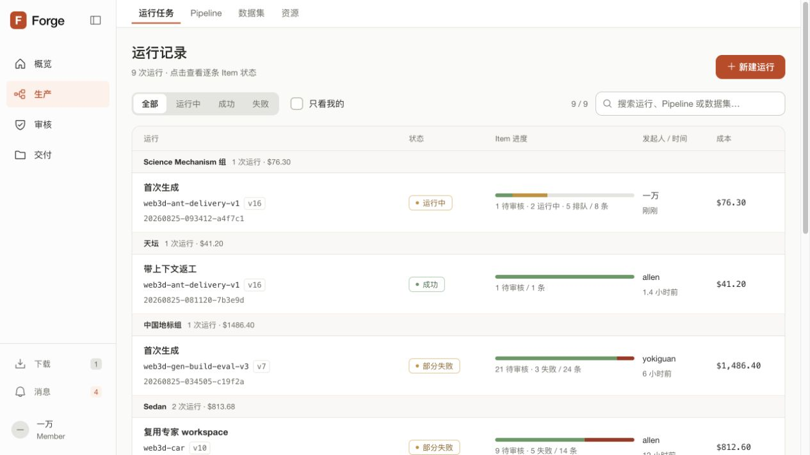
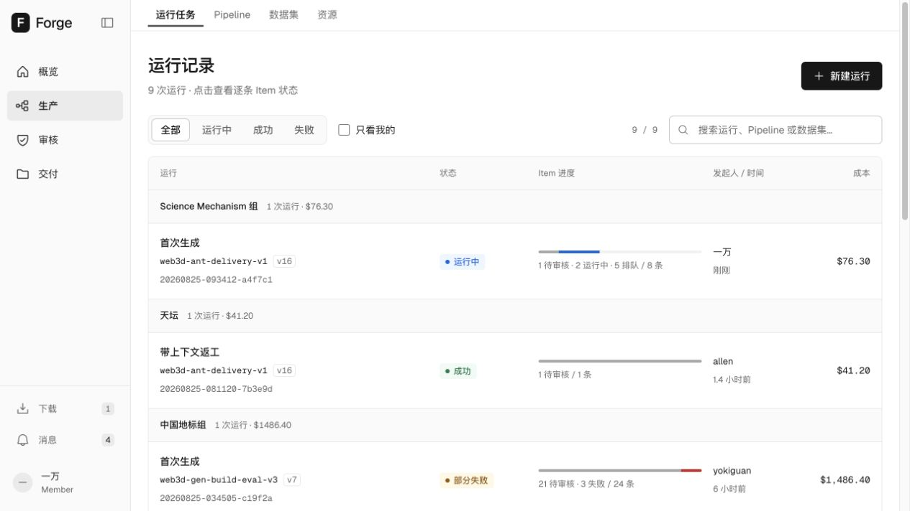
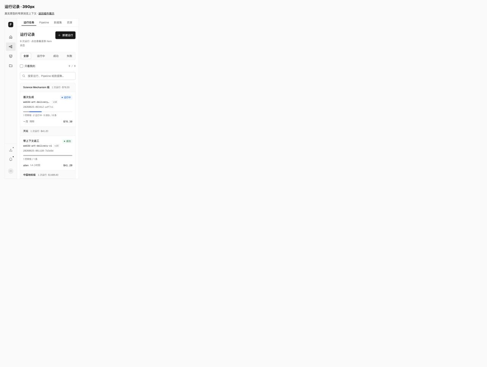
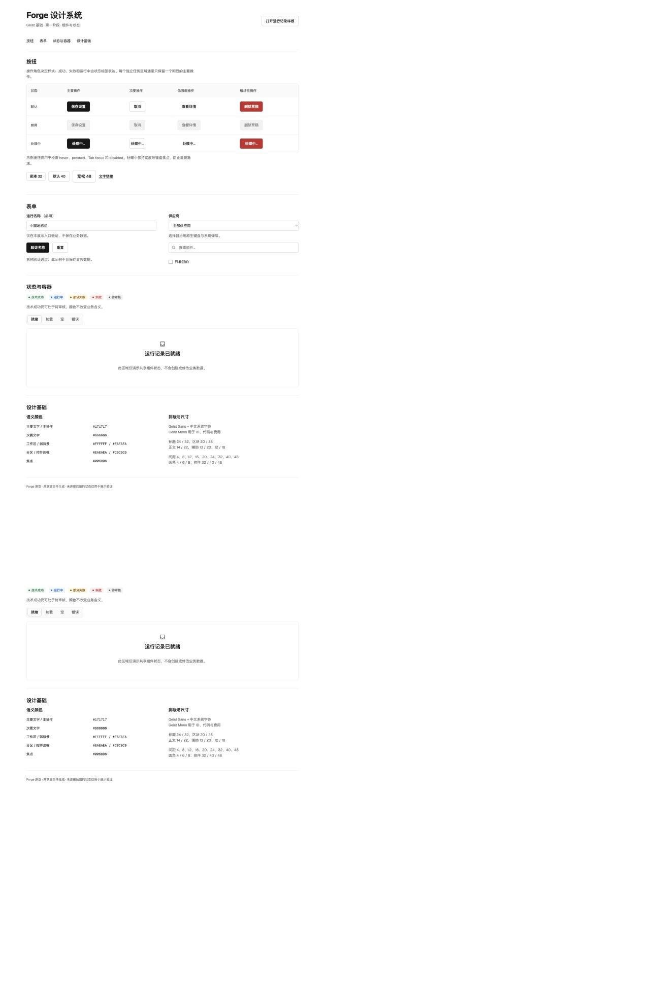

# 第一阶段验证 · 2026-09-03

## 运行环境与代码对应

- 开发目录：`/Users/apple/Documents/ChatGPT/forge 2/forge-ia-refresh`，独立仓库 `main`，工作树 HEAD `6fdfc5d`；外层仓库 `codex/forge-production-merged`。
- 本任务服务：`http://localhost:3011`，vinext 开发服务 PID 49500。既有 `3007` / PID 25568 保留。使用 vinext 官方支持的 `VINEXT_NO_DEV_LOCK=1` 在同一源码目录开启额外端口，没有删除锁或终止已有进程。
- HTTP 200。下载 `/forge.html` 与当前本地 `public/forge.html` 的 SHA-256 相同：`5b852b0f5e3218eafb1847b1a7f2d3e469bea01fb9511b3f9b728a602115943a`（验证时快照）。DOM 存在 `data-design-system="forge-geist-v1"`。
- 同工作副本中的另一项交付草稿修改在本任务期间持续更新；保留其文件。验证结论对应上述快照，不把全部仓库差异归属本任务。

## 自动检查

- 全项目 Node 测试：369 / 369 通过，0 失败（含本阶段 6 项回归）。
- `npm run build` 成功，完成 client / rsc / ssr 构建；vinext 提示部分路由静态分类为 Unknown，为框架静态分析提示，不是编译失败。
- 新增测试：迁移幂等、9 条运行／8 组数据与费用、组合筛选与恢复、第一运行空态、技术成功仍待审核、loading 防重复触发与恢复、文字／状态对比度。
- 将当前 Runs 数据代码去掉 3 类新增展示字段后，与任务开始备份精确比较：查询、分组、进度、费用、回调一致。全应用还包含其他任务的并行修改，不声称整份业务代码都未变化。
- 保留现有 181 个 Phosphor 图标的原始几何校验；为新进度布局更新旧样式断言，未取消业务测试。

## 浏览器实测

| 操作／状态 | 结果 |
| --- | --- |
| 默认列表 | 9 / 9；8 个分组；运行 ID、费用和 Item 计数与迁移前一致 |
| 运行中 → 只看我的 | 2 / 9 → 1 / 9 |
| 搜索不存在的运行 | 0 / 9，显示「没有匹配的运行」与清除入口 |
| 清除筛选与搜索 | 恢复 9 / 9，清空搜索、状态与归属条件 |
| 键盘 Enter 打开首条运行 | 进入 Science Mechanism 组；确切 ID `20260825-093412-a4f7c1`，8 Items，成本 $76.30 |
| 详情返回 | 回到运行记录，数据保持 |
| 新建运行 | 按既有顺序进入 Pipeline，未自动提交或创建 Run |
| 键盘焦点 | Tab 到「全部」，2px solid #0068d6 可见轮廓 |
| 主要按钮 | 40px 高、6px 圆角、Geist 字体栈，#171717 底／白字；hover 的 action-hover 规则已实现，本次未独立确认指针悬停 |
| 禁用／loading | 展示原生 disabled 与 aria-busy / aria-disabled；loading 保留可聚焦原生按钮；防重复激活另由单元测试验证 |
| 表单错误与恢复 | 空名称显示「请填写运行名称」；填写后显示验证通过，不保存业务数据 |
| 加载／空／错误 | 展示入口可切换静态骨架与文字、空结果、加载失败；清除／重试恢复就绪 |
| 窄屏 | `/design-system-responsive.html` 中真实原型 iframe 外框 390px、内容视口 388px；scrollWidth = clientWidth = 388，无横向溢出；运行中筛选仍返回 2 / 9 |
| 控制台 | 样板页未捕获 error 日志 |

没有新增装饰动画。加载骨架静态显示，新的基础控件无持续运动；已有侧栏／业务弹层动画实现及 reduced-motion 处理保留。窄屏使用真实 iframe 布局断点测试，未声称模拟触屏硬件或实测全部移动端手势。

运行列表使用同步内存数据，业务页面没有网络 loading／error；这两个状态在组件展示入口验证。首次无运行通过 `hasRuns:false` 的组件回归测试覆盖；不伪造真实请求来制造等待。原型权限、运行、审核、下载等后端行为不由本次视觉测试证明。

## 动效补充检查

按用户要求应用 `animate` 与 `animation-accessibility` skill。实际浏览器计算样式发现旧全局按钮规则向新 Button 和运行行附加了 120ms 过渡，旧 `:active` 规则也会缩放整行。已在共享 Button 和运行行边界隔离这两条属性，使展示入口与业务页面使用相同的即时反馈。

- 本次补充的设计系统回归测试 6 / 6 通过；没有为 CSS 边界改动重跑全项目构建，上面的完整测试／构建记录属于第一阶段快照。
- `localhost:3011` 页面刷新后，Button 与运行行实际计算样式均为 `transition: none`、`transform: none`。
- 鼠标点击「运行中」得到 2 / 9，键盘 Enter 激活「全部」恢复 9 / 9；键盘焦点为 2px 蓝色轮廓，过渡与变换均为 none。
- 实际查看刷新后的页面，布局与数据正常。本次浏览器系统偏好为 no-preference；隔离规则不依赖媒体条件，但没有在本次补充中模拟 reduce 或重测旧弹层动画。

## 可直接打开

- [运行记录样板](http://localhost:3011/forge.html?view=runs)
- [共享组件与状态](http://localhost:3011/design-system.html)
- [390px 响应式展示](http://localhost:3011/design-system-responsive.html)

服务保留供当前本机预览；没有公开部署。

## 截图

迁移前后采用相同默认数据与桌面浏览视口（1265 × 712 截图）。

