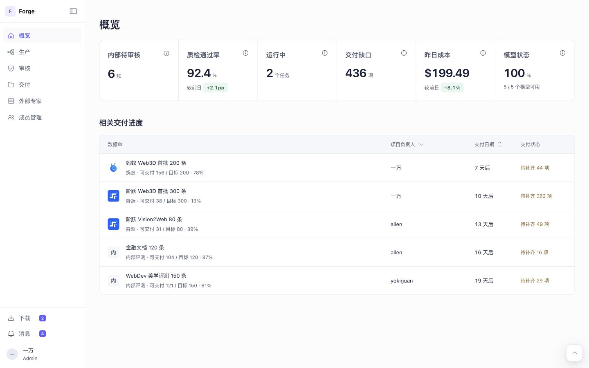
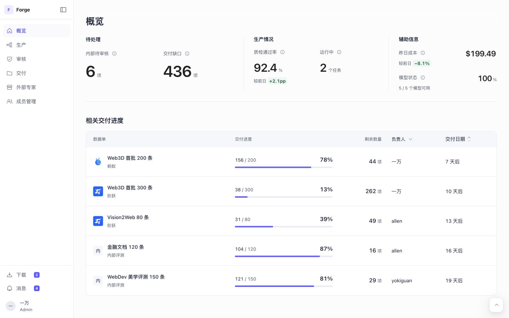
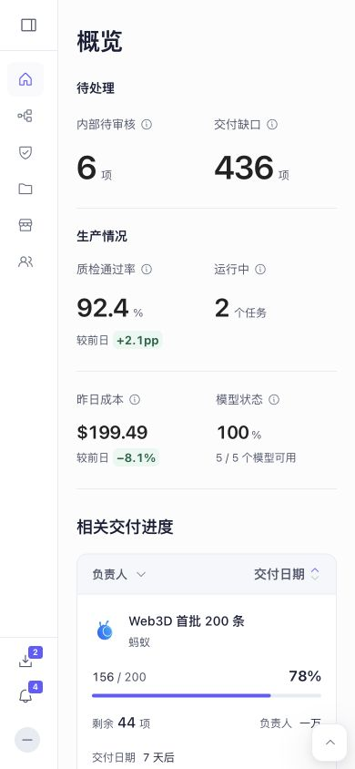
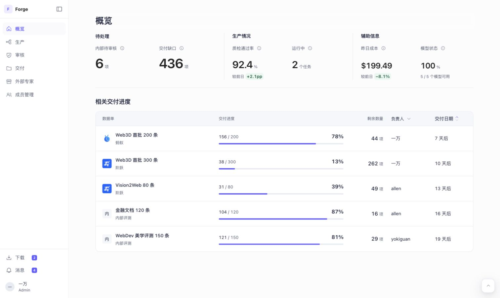
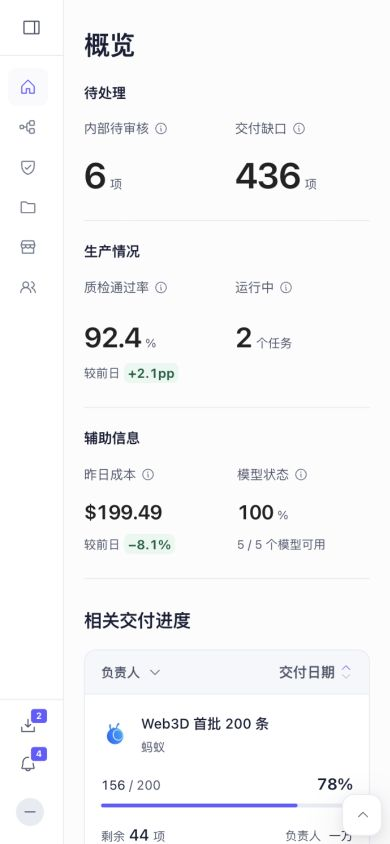
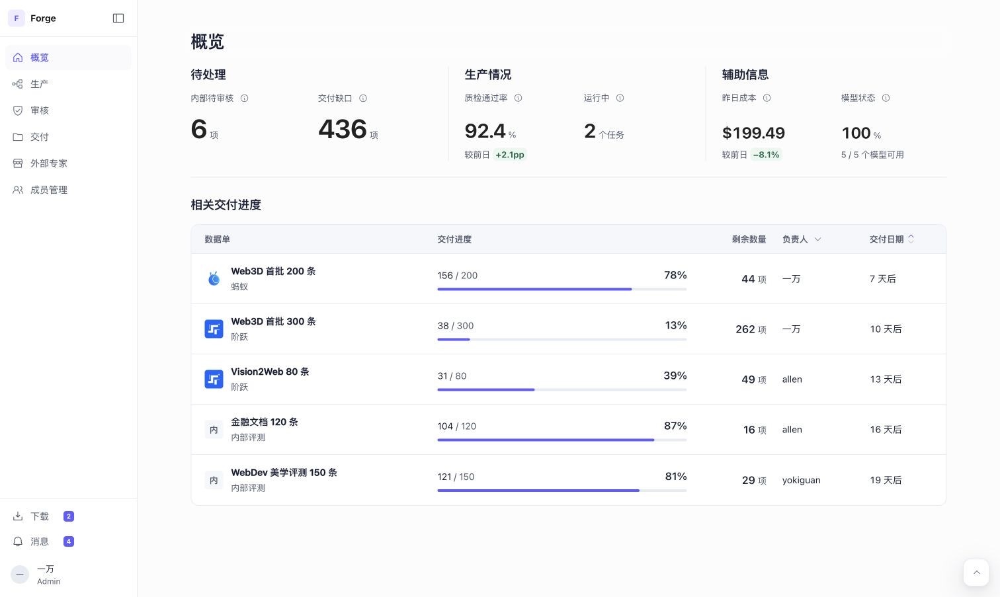

# Forge 概览本地改版与验证

本地预览：http://127.0.0.1:3010/forge-postman.html?route=%2Foverview
启动方式：项目根目录运行 `npm run preview:forge`。
本轮未部署、未推送 GitHub。

## 对应关系和范围

基于提交 `c4483f035d2984dafbcb0bc7c0967aae16305711`，对应当前线上 Sites 版本 79。已实际打开线上与本地页面，确认六项指标和交付表的布局、数据一致。
仅调整概览构图、交付表展示与键盘入口，继续使用现有模板、构建器、语义颜色、下拉菜单、排序图标和 Radix 提示组件。没有新增依赖。原有业务数据、权限与导航保持不变。

## 页面目标与改动

面向生产及交付负责人，先识别待处理，再比较各批交付。

- 六项指标归为待处理、生产情况、辅助信息。44 / 32 / 22px 数字层级与空间分组建立优先级；七位以上数字按可用宽度缩放，保留完整数字。
- 交付表按数据单、交付进度、剩余数量、负责人、交付日期排列。名称与客户组合，去掉重复客户前缀；准确数量、百分比与轻量进度条独立展示。
- 名称限制宽度并支持完整标题提示；窄屏换行。数字使用等宽数字，剩余数量右对齐。无目标时显示“—”，零剩余仍显示 0，不新增风险判断。
- 合并原先 pages.css 与 forge-system.css 中的概览布局规则；移除废弃概览断点规则，按内容容器切换布局。保留其他页面的规则。
- 原有负责人筛选、日期排序、六个指标入口、详情入口及 summary / delivery-progress 锚点保留；详情行支持 Enter 和空格，显示键盘焦点。

## 浏览器验证

使用 Codex 内置 Chromium 浏览器直接操作本地页面。

| 项目 | 结果 |
| --- | --- |
| 1440×900 桌面 | 六项指标、五行数据、所有五列表头正常；无横向溢出 |
| 1280px、768px、390px 窄屏 | 无横向溢出；手机折叠侧栏后内容正常，进度与剩余数量可读 |
| 原始数据 | 156/200、38/300、31/80、104/120、121/150 保留；六指标保留 |
| 数据边界 | 临时隔离页面验证 20 行、长中英文名称、0/0、0/200、200/200、123456/1234567 与七位指标；窄屏无数字截断，测试页面已删除 |
| 筛选与排序 | 选择 allen 得到两行，最近/最晚排序可切换，清除筛选恢复五行 |
| 六个指标 | 实际点击后分别进入待我审核、未达标交付、运行中、专家表现、昨日成本、模型状态页面，筛选参数正确 |
| 详情 | 鼠标入口保留，Enter 打开蚂蚁数据单；单元测试覆盖空格处理与忽略嵌套键盘事件 |
| 键盘焦点 | Tab 从负责人筛选进入日期排序再进入首行，首行出现 2px 紫色内嵌焦点框 |
| 下拉菜单 | 实际展开检查选项和圆角，Escape 可收起 |
| 对比度 | 主要数字 15.52:1；名称 16.24:1；辅助文字 7.30:1；指标标签 7.12:1；表头 6.82:1 |

## 自动检查

- `npm run build`：通过。
- `node --test scripts/test-overview-summary.mjs`：16 / 16 通过。
- `node --test --test-name-pattern='overview' scripts/test-postman-ui.mjs`：2 / 2 通过。
- `node --test scripts/test-routing.mjs`：13 / 13 通过。
- `git diff --check`：通过。
- 最终本地预览的浏览器错误日志：空。
- Impeccable layout detector：未报出问题，但缺少可选 HTML/CSS 解析器，仅降级正则扫描；不能代替实际浏览器验证。

未验证：Safari、Firefox、真实触摸设备、屏幕阅读器及深色主题；本轮没有执行整站无关测试，也没有验证真实后端服务。权限逻辑未作改动。

## 截图

修改前后桌面截图均为 1440×900，同一套业务数据。

## 既有文档差异

项目旧样板说明 `.impeccable/surfaces/public-forge-html.md` 仍指向已移除的 `public/forge.html`，部分品牌文案也旧于当前紫色设计系统。本轮以已发布版本对应的实际源码和当前共享 tokens 为准。该旧说明可另行更新为现有概览入口。

## 用户反馈后的布局修正

此前辅助指标采用标签左、数值右的布局，宽窗口把两者拉散；第一组标题的锚点还比其他标题多撑高 4px。本次移除辅助指标的横向排列，六项统一为标签上、数值下，并固定标题占位，统一数值区域底边。

- 容器最大宽度从 88rem 收为 76rem，指标字号层级调整为 40 / 30 / 24px。
- 辅助指标改为并排的两个完整信息组，所有标题和数值左对齐。
- 交付表名称列收紧，进度列扩大，行高从 84px 收为 76px；区域间距从 40px 收为 28px。
- 1512px 桌面实测六个标签 top 均为 135.36px，六个数值区域 bottom 均为 213.36px；1280px 与 390px 无横向溢出或指标截断。
- `npm run postman-ui`、两项 overview 构建集成测试、`git diff --check` 通过。
- 已直接刷新现有本地预览标签，未部署。

## 同级字体统一

修复表头普通文本、columnheader、按钮分别继承不同字体规则的问题。概览统一引用现有字体 tokens，浏览器实测：

| 文字角色 | 字号 / 行高 / 字重 |
| --- | --- |
| 四个区块标题 | 18px / 26px / 650 |
| 六项指标标签 | 13px / 20px / 400 |
| 五列表头及筛选、排序控件 | 13px / 20px / 650 |
| 表格正文与交付数量 | 14px / 20px / 400 |
| 百分比与剩余数量 | 16px / 24px / 550 |
| 客户、单位与辅助说明 | 13px / 20px / 400 |

桌面和 390px 窄屏已实测，无文字截断或横向溢出。Postman 构建、两项概览集成测试、diff 检查通过。已刷新本地预览，未部署。

